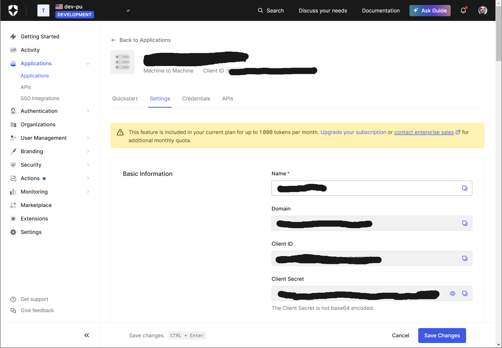
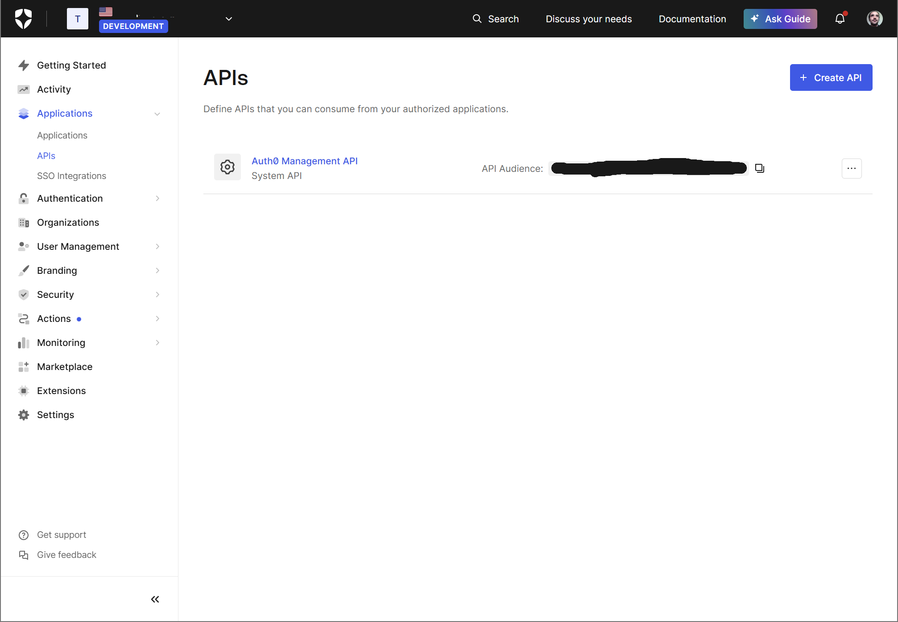

# *WIP* RUST Backend template: GraphQL/PostgreSQL/JWKS
This repository provide a production ready stateless backend application template written in Rust.
Its mainely design to be the backend of a SaaS or mobile application backend featuring a GraphQL API, a PostgreSQL database (that can be embedded in the application or external) and a JWKS authentication compatible with Auth0 or any other provider supporting JWKS and OpenID Connect.

The goal is to provide a proper starting point for building highly available, secure, and performant backend applications while avoiding common pitfalls.
The code feature clean architecture and is designed in a modular way as well as follow RUST best practices empowering concurrency and performance at runtime but also buildtime featuring fast compilation times and responsive rust analyzer performance.
This repository came with all the containerisation and CI/CD setup to deploy the application in a cloud environment with proper observability.
But even better it came with everythings you need to easyly build proper developpement flows and testing pipelines ! It features embeded database and developpement tools !

## Features overview
- Flexible webserver with axum
- Proper Asynchronous GraphQL API
- Auth0 user management with JWT verification
- PostgreSQL Database management
    - Migrations
    - Usage of Entity pattern
    - Use latest sqlx version with async support
- Tracing & Error handling
    - Use of tracing for flexible and structured logging
    - Use of thiserror for type safe error handling
- CI/CD pipeline
    - Docker image with proper dependencies caching
- Testing & Developpement
    - Feature authentication free mode for development and testing
    - Allow fast developpement setup with embeded database
    - Feature integration tests execution with isolated database and parallel execution
- Multiplatform (Linux/MacOS/Windows)

## Demo frontend
This template came with an fully featured example of frontend application that uses the `expo` framework to build a mobile/web application that use the  API and perform authentication using Auth0.

## How to prepare and run the project
There is various way to run the project depending on your needs.
For development, you can use the `embedded-database` feature to have a fast setup with an embeded database.
For production or regular development, you will want to use an externaly installed database.

### Prerequisites
- Latest stable Rust toolchain

### OIDC Provider
You need to setup an OIDC provider that support JWKS and OpenID Connect in order to use the authentication feature.
To do so we will use Auth0 as an example but you can use any other OpenID Connect provider that support JWKS and OpenID Connect.

#### Auth0
You will need to create a new application in your Auth0 tenant and get the following information:
- Client ID
- Client Secret
- Domain
- Audience

Here is a picture of the Auth0 application settings:



The audience is the API identifier, you can find it under the "settings" section of your application:




### Preparing your environment
You can use the `.env.example` as a template to create your own `.env` file with the correct environment variables.

### Running the project
#### Development
To run the project in development mode, you can use the following command:

```bash
cargo run --features embedded-database
```

or if you want to run the project without the embedded database:
> You also can use the `DATABASE_URL` environment variable to set the database url.
```bash
cargo run --database-url <your-database-url>
```

```bash
cargo run
```

Once the application is running, you can test the API using your browser and directly access the GraphQL playground at `http://<listen_address>/graphql`

Once whithin the playground you can test the API with the following query:

```graphql
query {
  getCurrentUserFeed(category: HOME, limit: 0) {
    offset
    posts {
      content
    }
  }
}
```
