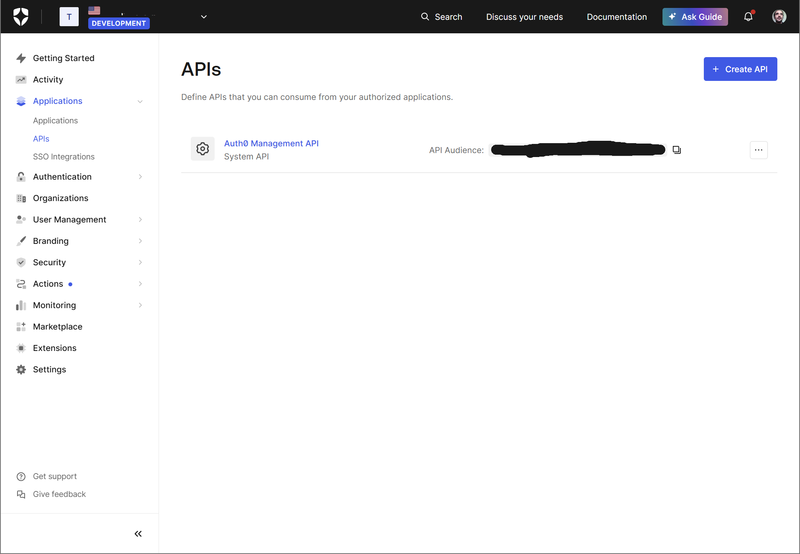

# Auth0 Setup Guide
This guide walks you through setting up your Auth0 tenant to use with the template's authentication feature.

## Prerequisites
- An Auth0 account (you can sign up at [auth0.com](https://auth0.com))
- Access to your Auth0 dashboard

## Setup Steps

### 1. Create a New API
1. In your Auth0 dashboard, go to `Applications > APIs`
2. Click `+ Create API`
3. Fill in the following:
   - Name: (your preferred name)
   - Identifier (Audience): keep the default value or use your own domain if you want
4. Save the API Identifier (Audience) - you'll need this later (you can find it under the "settings" section of your application like in the picture below)

### 2. Create Application
1. Go to `Applications > Applications`
2. Click `+ Create Application`
3. Select `Single Page Application`
4. Name it `Rave Frontend` (or your preferred name)
5. Go to the application settings

### 3. Configure Application Settings
1. Under `Application Properties`:
   - Note down the `Client ID`
   - Note down the `Client Secret`
   - Note down the `Domain`
2. Under `Application URIs`:
   - Allowed Callback URLs: `http://localhost:3000/callback`
   - Allowed Logout URLs: `http://localhost:3000`
   - Allowed Web Origins: `http://localhost:3000`
   
### 4. Configure Environment Variables
Add the following environment variables to your backend: